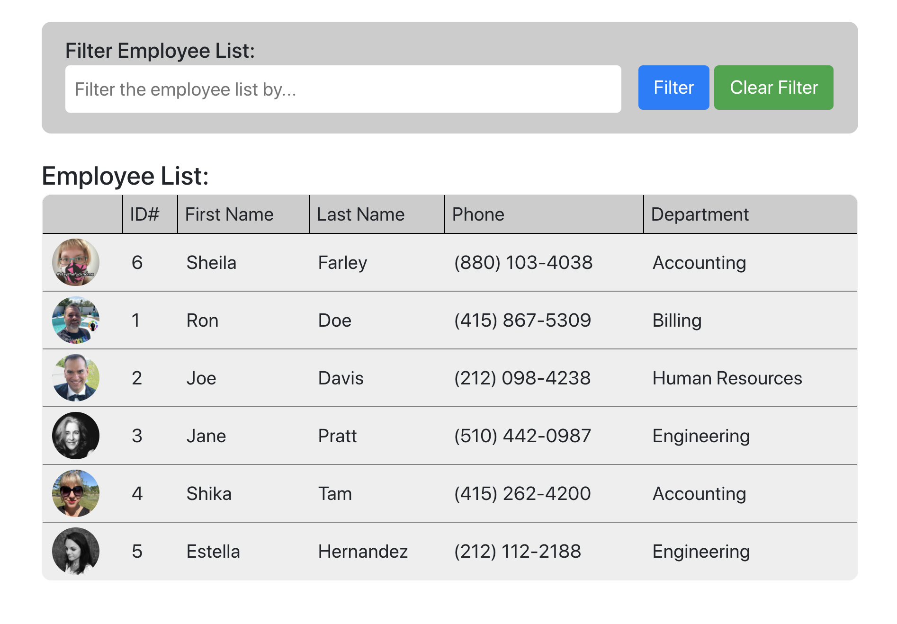

# Name-Search
A React app that allows a user to view a list of employees filtered by a search field, and sort the list



# Table of contents

  - [Installation](#installation)
  - [Usage](#usage)
  - [Live Demo](#live-demo)
  - [License](#license)
  - [Features](#features)
  - [Technology](#technology)
  - [Badges](#badges)
  - [User Story](#user-story)
  - [Business Context](#business-context)


<a name="Installation"></a>
## Installation
```sh
npm install
```
<a name="Usage"></a>
## Usage
```sh
Usage
```
<a name="Live_Demo"></a>
## Live Demo
live demo
<a name='License'></a>
## License
[](https://lbesson.mit-license.org/)
<a name="Features"></a>
## Features
1. display list of employee info
2.  filter list by search field
3.  sort by first name
4.  last name
5.  etc.
<a name="Technology"></a>
## Technology
1. React
2.  Javascript
3.  CSS
4.  Bootstrap

<a name="User_Story"></a>
## User Story
```sh
As a user, I want to be able to view my entire employee directory at once so that I have quick access to their information.
```
<a name="Business_Context"></a>
## Business Context
An employee or manager would benefit greatly from being able to view non-sensitive data about other employees. It would be particularly helpful to be able to filter employees by name.


<a name="Badges"></a>
## Badges
 [](https://shields.io/)

**on github:** <a href='github.com/b0rgBart3'>b0rgBart3</a>

[](https://github.com/remarkablemark)

Email: borgBart3@gmail.com
